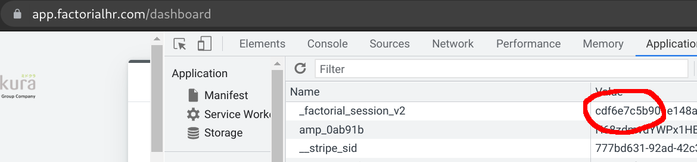

# Fill in Factorial clock-in hourse with puppeteer

Install puppeteer with `yarn install`.

Run `yarn start START_YEAR START_MONTH COOKIE` to fill in all clock in
hours from 10:00 to 18:00 until present day (or december if not current year).

Example:

Open factorial in Chrome, press `Ctrl+Shift+i` or click "Hamburger menu" (3 
dots) -> More Tools -> Developer Tools.

Then click "Application" tab and selected "Cookies" then
"https://<whatever>.factorialhr.com".



Double click on "Value" column for the row "_factorial_session_v2" and copy to
clipboard.

Ready to let the magic happen, starting from July 2021 until present day:

```
yarn start 2021 7 c3c939c9293c9ccc9c93e2e3d98a
```

The terminal output always ends with some error when no more days are fillable.
You're good!
